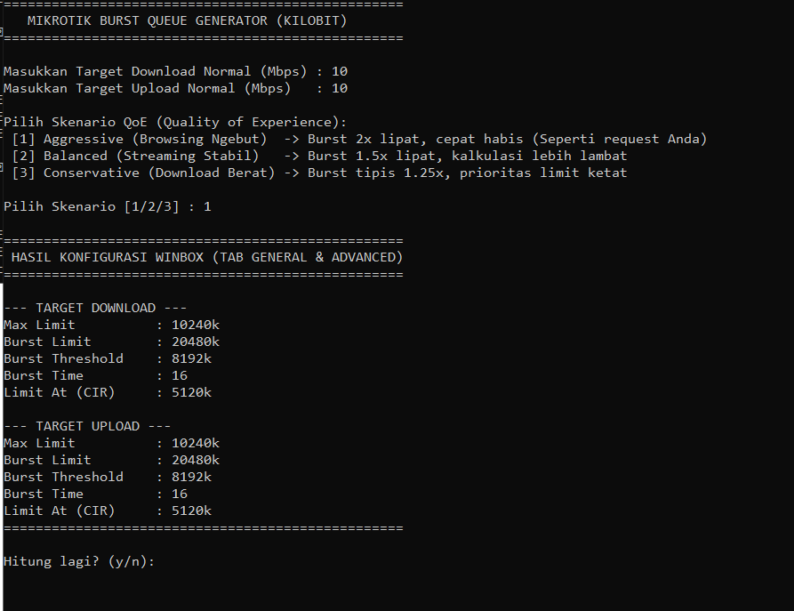

# MikroTik Burst Queue Calculator 🚀

Sebuah *script* Python interaktif dan modular berbasis Command Line Interface (CLI) untuk menghitung parameter *Burst* pada Simple Queue MikroTik. *Script* ini membantu Network dan Server Administrator menghasilkan perhitungan *bandwidth* yang presisi dalam satuan kilobit (`k`) untuk meningkatkan *Quality of Experience* (QoE) pengguna.



## ✨ Fitur Utama
* **Konversi Presisi:** Mengubah input Mbps yang simpel menjadi output kilobit murni (1 Mbps = 1024 kbps) sesuai standar pembacaan sistem MikroTik (Winbox/Terminal).
* **3 Skenario Otomatis (QoE Profiles):**
    * 🔥 **Aggressive:** Melipatgandakan kecepatan di awal koneksi (*snappy browsing*).
    * ⚖️ **Balanced:** Kompromi yang seimbang untuk aktivitas *streaming* yang stabil.
    * 🐢 **Conservative:** Pengawasan ketat untuk jaringan dengan beban *download* berat.
* **Perhitungan CIR (Committed Information Rate):** Otomatis menyarankan nilai `Limit At` sebagai garansi *bandwidth* dasar.

## 🛠️ Cara Penggunaan
Pastikan sistem Anda sudah terinstal Python 3.

1. Clone repositori ini:
   ```bash
   git clone https://github.com/classyid/py-mikrotik-burst-calc.git
   cd py-mikrotik-burst-calc
